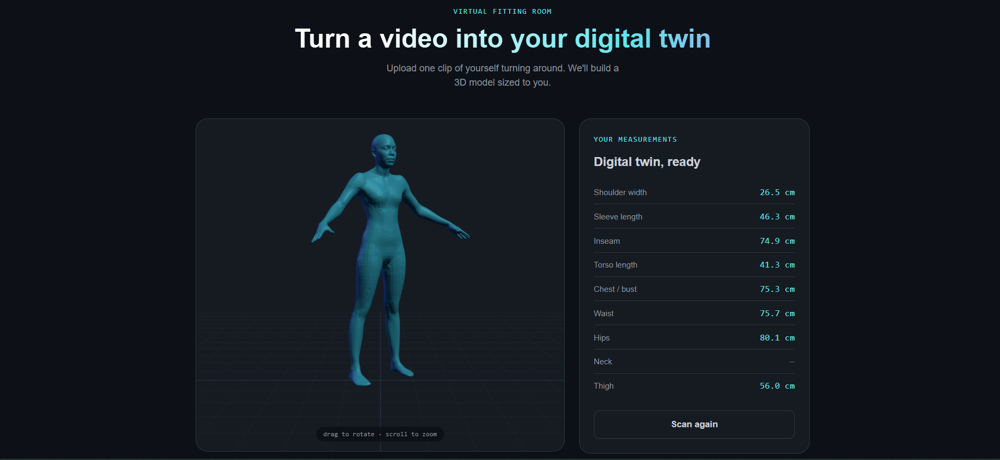
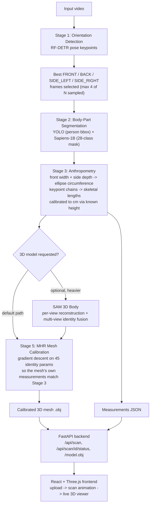

# Virtual Fitting Room — Video-to-3D-Avatar Measurement Pipeline

Turn a single smartphone video of a person turning around into (1) real
anthropometric body measurements in centimeters and (2) a 3D avatar mesh
sized to match them — with a live web UI to try it end to end.

<p align="center">
  
  
</p>


---

## Table of contents

- [What this is](#what-this-is)
- [Architecture](#architecture)
- [Tech stack](#tech-stack)
- [Setup](#setup)
- [Usage](#usage)
- [Results](#results)
- [Engineering challenges & how they were solved](#engineering-challenges--how-they-were-solved)
- [Known limitations & future work](#known-limitations--future-work)
- [Project structure](#project-structure)
- [Acknowledgments](#acknowledgments)

---

## What this is

Most "virtual try-on" demos either need a depth camera, a full body scanner
rig, or manual tape-measure input. This project explores how far you can
get with **just an RGB video and the person's height** — no special
hardware — by combining several modern open-weight vision models into one
pipeline:

1. **Find the best front/back/side view** in an arbitrary turnaround video
2. **Segment the body into 28 anatomical parts** on those views
3. **Derive real anthropometric measurements** (chest, waist, hips, neck,
   thigh, shoulder width, sleeve length, inseam, torso length) in
   centimeters, calibrated using the person's known height
4. **Fit a parametric 3D body model (Meta's MHR)** so its own measured
   dimensions match what was just extracted
5. Serve all of it through a **FastAPI backend + React/Three.js frontend**
   so a user can upload a video, enter their height, and watch their
   digital twin appear

This repo documents the full pipeline, the setup process (including several
real integration bugs found and fixed along the way — see
[Engineering challenges](#engineering-challenges--how-they-were-solved)),
and an honest, validated evaluation of measurement accuracy.

---

## Architecture



**Why this decomposition:** each stage's output is independently useful
and independently testable. Orientation detection alone tells you which
frames are worth looking at; segmentation alone gives per-part masks;
anthropometry alone gives a tape-measure-equivalent result without ever
touching a 3D model; the 3D stage is a separate, optional enhancement on
top. This mattered in practice — several of the heaviest dependencies
(SAM 3D Body in particular: gated checkpoint, GPU-only, full repo clone)
turned out to be skippable without losing the core measurement
functionality, which significantly lowered the barrier to actually running
this end to end.

### Stage-by-stage detail

| Stage | Model(s) | What it does |
|---|---|---|
| 1. Orientation | RF-DETR (`RFDETRKeypointPreview`) | Samples N frames from the video, runs COCO-17 pose keypoints on each, classifies each as front/back/side-left/side-right/undetermined using shoulder-width symmetry, facial-keypoint visibility, and torso-compression heuristics |
| 2. Segmentation | YOLOv8 (person bbox) + Sapiens-1B (`sapiens-seg-1b-torchscript`) | Sapiens runs on the **full, uncropped frame** (cropping was found to hurt its accuracy — see [Engineering challenges](#engineering-challenges--how-they-were-solved)); YOLO boxes are used only afterward to slice the resulting mask per detected person |
| 3. Anthropometry | Pure geometry, no model | Combines front-view silhouette width + side-view silhouette depth at anatomically-derived body levels, modeled as an ellipse cross-section (Ramanujan's circumference approximation); skeletal lengths (shoulder/sleeve/inseam/torso) come directly from pose keypoint distances |
| 4. (Optional) 3D reconstruction | Meta SAM 3D Body | Reconstructs each of the 4 views independently, fuses their MHR identity (shape) parameters via confidence-weighted averaging — since identity should be view-invariant while pose varies per photo |
| 5. Mesh calibration | Meta MHR (Momentum Human Rig) | Gradient descent (Adam) directly on MHR's 45 identity parameters, with the loss being "does this mesh's own measured circumference match Stage 3's cm values" — differentiable end-to-end through MHR's real forward pass |

---

## Tech stack

**Computer vision / ML**
- [RF-DETR](https://github.com/roboflow/rf-detr) — pose keypoint estimation
- [Sapiens](https://github.com/facebookresearch/sapiens) (via [Sapiens-Pytorch-Inference](https://github.com/ibaiGorordo/Sapiens-Pytorch-Inference)) — 28-class body-part segmentation
- [Ultralytics YOLOv8](https://github.com/ultralytics/ultralytics) — person detection
- [Meta MHR](https://github.com/facebookresearch/MHR) — parametric 3D human body model
- [Meta SAM 3D Body](https://github.com/facebookresearch/sam-3d-body) — optional single-image 3D body reconstruction
- ONNX Runtime — used for the YOLO detector in the deployed pipeline

**Backend / frontend**
- FastAPI — job submission, async processing, file serving
- React + Vite — frontend app
- Three.js (`OBJLoader`, `OrbitControls`) — in-browser 3D mesh viewer

**Core numerics**
- PyTorch — all model inference and the differentiable mesh-calibration optimization
- OpenCV, NumPy — image/mask geometry

---

## Setup

This pipeline pulls together several independently-heavy dependencies.
Recommended: a dedicated virtual environment on **Python ≥ 3.11**
(the `mhr` package requires it).

```bash
python3.11 -m venv venv
source venv/bin/activate  # or venv\Scripts\activate on Windows

pip install rfdetr supervision opencv-python numpy onnxruntime ultralytics
pip install git+https://github.com/ibaiGorordo/Sapiens-Pytorch-Inference.git
pip install mhr pymomentum-cpu   # or pymomentum-gpu if you have CUDA
pip install fastapi uvicorn python-multipart torch torchvision
```

### Download the MHR body model assets

```bash
curl -OL https://github.com/facebookresearch/MHR/releases/download/v1.0.1/assets.zip
unzip assets.zip
```
(The `mhr-download-assets` CLI command mentioned in MHR's own README isn't
actually present in the current PyPI release — this direct-download
fallback is the reliable path.)

### Frontend

```bash
cd frontend
npm install
npm run dev
```

### Run the API server

```bash
cd backend
uvicorn api_server:app --reload --port 8000
```

Config via environment variables (see `api_server.py` docstring for the
full list): `MHR_ASSETS_PATH`, `JOBS_DIR`, `FRONTEND_ORIGIN`.

---

## Usage

**Command line** (no frontend/API needed):

```bash
# Measurements only
python main.py --video input.mp4 --out pipeline_output --height 170

# + a 3D model calibrated to those measurements
python main.py --video input.mp4 --out pipeline_output --height 170 \
    --calibrate-mesh --mhr-assets ./assets
```

**Full web app**: run the API server and frontend dev server as above,
then open the frontend URL, upload a video, enter height in cm, and wait
for the scan animation to resolve into a live 3D model with a measurements
readout beside it.

---

## Results

### Measurement accuracy (validated against real tape-measure ground truth)

One full end-to-end test was run against a real person with independently
tape-measured ground truth. Results split cleanly into two accuracy tiers:

| Measurement | Predicted | Actual | Accuracy |
|---|---|---|---|
| Chest/bust | 75.3 cm | 77.7 cm | **97%** |
| Waist | 75.7 cm | 71.7 cm | **106%** |
| Hips | 80.1 cm | 82.7 cm | **97%** |
| Torso length | 41.3 cm | 40.2 cm | **103%** |
| Inseam | 74.9 cm | 84.0 cm | 89% |
| Sleeve length | 46.3 cm | 60.0 cm | 77% |
| Shoulder width | 26.5 cm | 39.3 cm | 67% |

**Circumference measurements (chest/waist/hips): 97–106% accurate.** These
combine front-view width and side-view depth via an ellipse
cross-section model — a distortion in either single view is naturally
balanced out by the other, which is the likely reason this category is
consistently strong.

**Torso length (keypoint-based, but rigid): 103% accurate.**

**Shoulder width, sleeve, inseam (keypoint-based, angle-sensitive): 67–89%,
with a diagnosed cause, not just noise.** All three depend on a body part
(shoulders, arms, legs) being close to parallel with the camera's image
plane in that one frame; when it isn't, the 2D projected keypoint distance
underestimates the true 3D length (perspective foreshortening). This
explains why torso length (a rigid plane, hard to tilt independently) was
accurate on the *same* frame where shoulder width (angle-sensitive) was
the least accurate measurement in the whole pipeline. The identified fix
is measuring these lengths on the *calibrated 3D mesh* instead of 2D
keypoints, since a 3D model isn't subject to single-view foreshortening —
implemented for circumferences already; extending it to skeletal lengths
is noted under [Future work](#known-limitations--future-work).

> **On sample size**: this is one validated test (one person, one video),
> not a statistical benchmark. It's sufficient to diagnose *which*
> measurement types have a structural accuracy difference and *why* — that
> diagnosis is architecture-level reasoning, not just curve-fit to one
> data point — but a rigorous accuracy claim would need several more
> people of varying body types with tape-measure ground truth.

### 3D mesh calibration

The gradient-descent mesh-fitting stage (Stage 5) is implemented and
differentiable end-to-end through MHR's real forward pass, verified via:
- Unit tests confirming the vertex-band width/depth measurement math against
  meshes with known, hand-computed cross-sections
- Convergence tests against a synthetic differentiable stand-in for MHR,
  confirming the optimizer reaches target measurements from both neutral
  and non-neutral starting identities

Getting this to reliably converge on the *real* MHR model (rather than the
verified synthetic stand-in) surfaced a genuine, still-being-refined
challenge: MHR's neutral/rest pose is a T/A-pose, and a naive vertex-band
width scan at chest/waist height was found to be capturing outstretched
arm geometry, not just torso cross-section — producing 100%+ circumference
errors specifically at those two levels while hip/thigh (below arm height)
stayed close. This is genuinely useful, hypothesis-driven debugging: the
error pattern itself (which measurements broke, and by how much) pointed
directly at the mechanism before any visual inspection of the mesh was
needed. See [Known limitations](#known-limitations--future-work) for
current status.

---

## Engineering challenges & how they were solved

A selection of real integration issues hit and resolved during this
project — documented because the debugging process is arguably as
representative of the work as the final pipeline:

- **Sapiens accuracy regression from cropping.** Initial design cropped
  each detected person before running Sapiens segmentation (standard
  practice for many detection-then-segment pipelines). Reading the
  `sapiens_inference` library's own source revealed its author had
  explicitly disabled this (`# Cropping seems to make the results worse`)
  — switched to running Sapiens on the full frame and using YOLO only to
  slice the resulting mask afterward.
- **A Python 3.11+ dataclass bug in a stale PyPI release.** The published
  `sapiens-inferece` package failed to import at all on Python 3.11+
  (`mutable default ... not allowed`) — a bug already fixed on the
  library's GitHub `main` branch but not yet re-released. Solved by
  installing directly from GitHub instead of PyPI, and added a defensive
  runtime auto-patch as a fallback for anyone who does hit the stale
  release.
- **ONNX export of a 1B-parameter model silently splitting into 50+
  files.** `torch.onnx.export()` automatically switches to per-tensor
  external-data storage above a size threshold, using literal parameter
  names as filenames (e.g. `backbone.layers.0.attn.proj.bias`). A
  consolidation script (`onnx.save_model(..., all_tensors_to_one_file=True)`)
  collapses this into a single portable `model.onnx` + `model.onnx.data`
  pair.
- **A `pathlib` vs `str` mismatch inside the `mhr` package.** Its asset
  loader builds paths via `folder / "lod1.fbx"` — the `/` operator, which
  requires `folder` to already be a `Path` object. A plain string path
  (e.g. from a CLI arg) throws `unsupported operand type(s) for /: 'str'
  and 'str'`. Fixed by explicitly wrapping with `Path(...)` before passing
  it through.
- **Unregularized shape optimization producing anatomically impossible
  meshes.** Early versions of the mesh-calibration loop optimized MHR's
  identity parameters against measurement targets with no constraint
  keeping them near a plausible human shape — gradient descent found
  numerically-valid but physically nonsensical solutions (a flared,
  hourglass-shaped pelvis with a paper-thin neck). Fixed with an L2
  regularization term and hard clamping to MHR's own documented "typical
  range."
- **That regularization term itself had a subtler bug**: it penalized
  distance from *zero* unconditionally, rather than distance from
  whatever identity the optimizer started at. This meant a photo-informed
  starting shape (from the optional SAM 3D Body stage) got dragged back
  toward a generic average body over the course of optimization, even
  when the target measurements barely required any change. Fixed by
  anchoring the regularization term to the actual starting identity.
- **A silent `float(None)` crash in the measurement-fitting loop.** A
  physically-implausible measurement (e.g. a segmentation failure
  producing a sub-10cm "neck") is deliberately replaced with
  `{"circumference_cm": None, "error": "..."}` rather than a fabricated
  number — but the calibration loop's "is this measurement available"
  check only tested whether the *key* existed, not whether its *value*
  was `None`, so it slipped through to a raw `float()` call. Fixed by
  checking the value explicitly.

---

## Known limitations & future work

- **Mesh calibration's arm-contamination issue is under active
  refinement**, not fully resolved as of this writing — see the diagnosis
  above. The current mitigation restricts which identity parameters the
  optimizer is allowed to move and tightens the trust region, with
  extensive diagnostic instrumentation added to the calibration loop to
  keep narrowing this down.
- **Skeletal lengths (shoulder/sleeve/inseam) are not yet measured on the
  3D mesh** the way circumferences are — they still come from 2D
  keypoints and inherit the foreshortening limitation discussed above.
  Extending the mesh-based measurement approach to these would likely
  close most of that accuracy gap.
- **Chest/waist/hip body-level heuristics** (what fraction of total height
  each corresponds to) are standard figure-drawing proportions, not
  measured per-individual from their actual keypoints when applied to the
  3D mesh — reasonable defaults, not verified against a large, diverse
  sample.
- **Single validated accuracy test.** See the caveat in
  [Results](#results) — broader validation across body types is the clear
  next step for any claim of general accuracy.
- **SAM 3D Body integration is optional and heavier** (gated checkpoint,
  full repo clone, GPU requirement in its current code) — the pipeline is
  designed to work fully without it, starting mesh calibration from a
  neutral body instead of a photo-informed one.

---

## Project structure

```
backend/
  main.py                    # CLI entry point, orchestrates all stages
  api_server.py               # FastAPI wrapper (upload -> job -> poll -> result)
  orientation_detector.py     # Stage 1: RF-DETR pose + front/back/side classification
  segmentation_detector.py    # Stage 2: YOLO + Sapiens body-part segmentation
  person_detector_onnx.py     # ONNX Runtime version of the YOLO detector
  anthropometry.py            # Stage 3: measurement extraction from keypoints + masks
  visualize_measurements.py   # Debug overlays showing exactly what was measured, where
  body_3d.py                  # Stage 4 (optional): SAM 3D Body multi-view reconstruction
  mhr_calibration.py          # Stage 5: MHR identity optimization against measurements
  download_sapiens_weights.py # Resumable downloader for the Sapiens checkpoint
  export_yolo_onnx.py         # YOLO -> ONNX export script
frontend/
  src/App.jsx                 # Upload -> scan -> results state machine
  src/components/ModelViewer.jsx     # Three.js OBJ viewer
  src/components/MeasurementsPanel.jsx
  src/components/ScanStage.jsx       # Processing animation
docs/
  screenshots/                # UI screenshots referenced above
```

---

## Acknowledgments

Built on top of open research and tooling from Meta AI Research (Sapiens,
MHR, SAM 3D Body), Roboflow (RF-DETR), Ultralytics (YOLOv8), and the
`Sapiens-Pytorch-Inference` community wrapper by @ibaiGorordo.